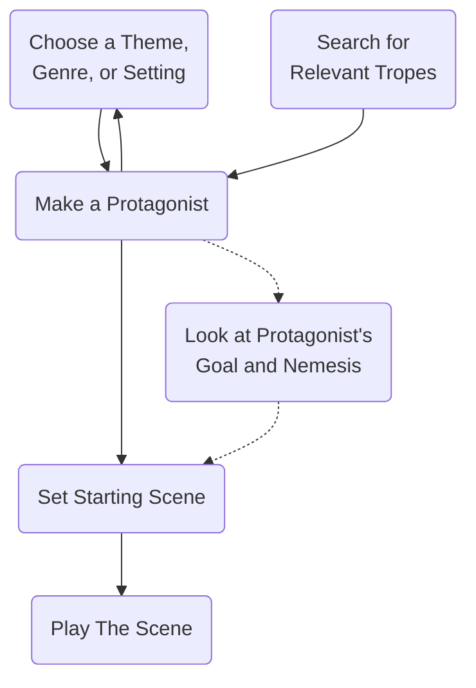
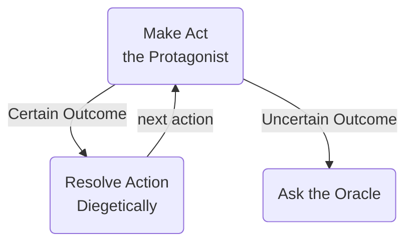

# Get Started

```mermaid
flowchart TD
    st1(Choose a Theme, \n Genre, or Setting)
    st2(Search for \n Relevant Tropes)
    id1(Set Starting Scene)
    pg1(Make a Protagonist)

    st1-->pg1
    st2--> pg1
    pg1 --> id1
    pg1 --> st1
    pg1 -.->pg2
    pg2(Look at Protagonist's \n Goal and Nemesis) -.-> id1
    id1 --> id2(Play The Scene)
```
# Take Action

```mermaid
flowchart TD
    id1(Make Act \n the Protagonist)
    id2(Resolve Action \n Diegetically)
    id3(Ask the Oracle)

    id1 -- Certain Outcome --> id2
    id2 --next action --> id1
    id1 -- Uncertain Outcome --> id3

```