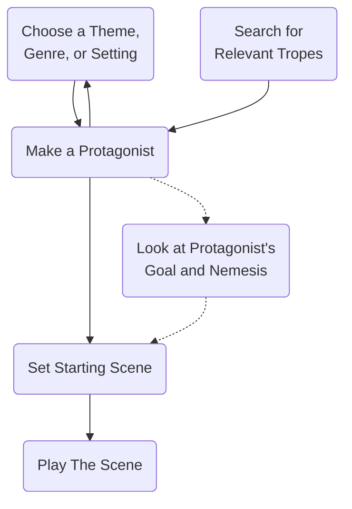
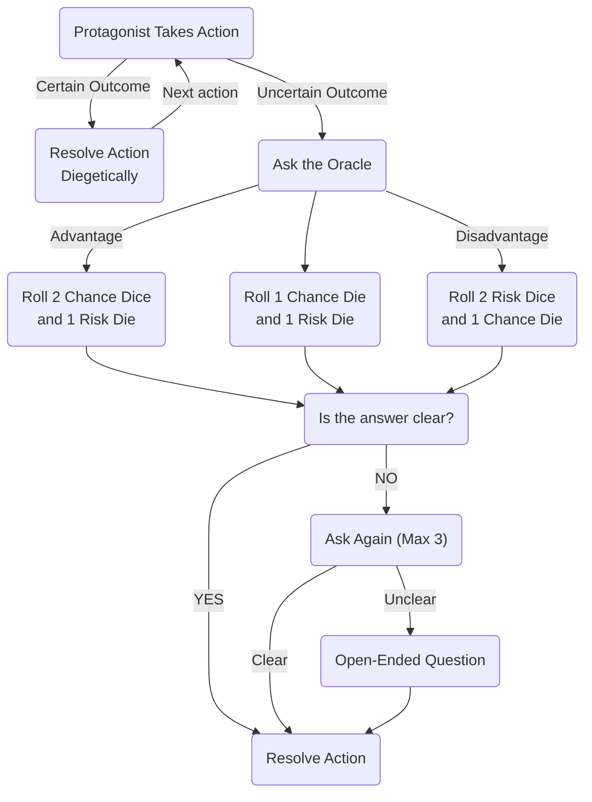

# Get Started

```mermaid
flowchart TD
    st1(Choose a Theme, \n Genre, or Setting)
    st2(Search for \n Relevant Tropes)
    id1(Set Starting Scene)
    pg1(Make a Protagonist)

    st1-->pg1
    st2--> pg1
    pg1 --> id1
    pg1 --> st1
    pg1 -.->pg2
    pg2(Look at Protagonist's \n Goal and Nemesis) -.-> id1
    id1 --> id2(Play The Scene)
```
# Take Action

```mermaid
flowchart TD
    id1(Protagonist Takes Action)
    id2(Resolve Action \n Diegetically)
    id3(Ask the Oracle)
    id4(Roll 2 Chance Dice \n and 1 Risk Die)
    id5(Roll 2 Risk Dice \n and 1 Chance Die)
    id6(Roll 1 Chance Die \n and 1 Risk Die)
    id7(Is the answer clear?)

    id1 -- Certain Outcome --> id2
    id2 -- Next action --> id1
    id1 -- Uncertain Outcome --> id3
    id3 -- Advantage --> id4
    id3 --> id6
    id3 -- Disadvantage --> id5
    id4 --> id7
    id6 --> id7
    id5 --> id7 
    id7 -- YES --> id8(Resolve Action)
    id7 -- NO --> id9("Ask Again (Max 3)")
    id9 -- Clear --> id8
    id9 -- Unclear --> id11(Open-Ended Question)
    id11 --> id8
```
# Ask the Oracle