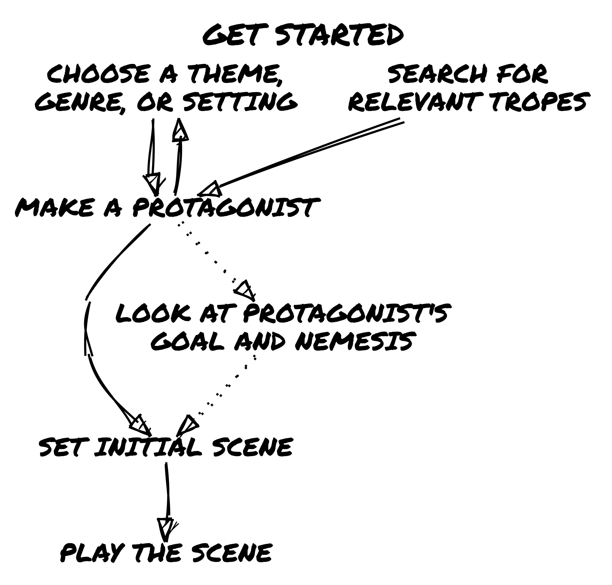
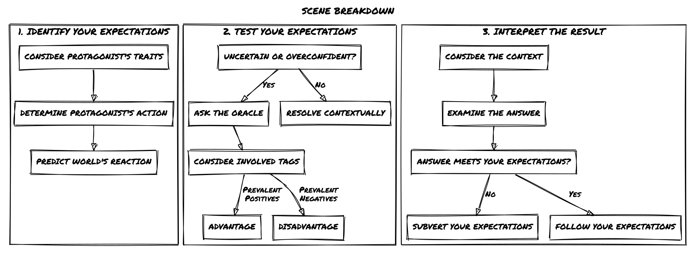
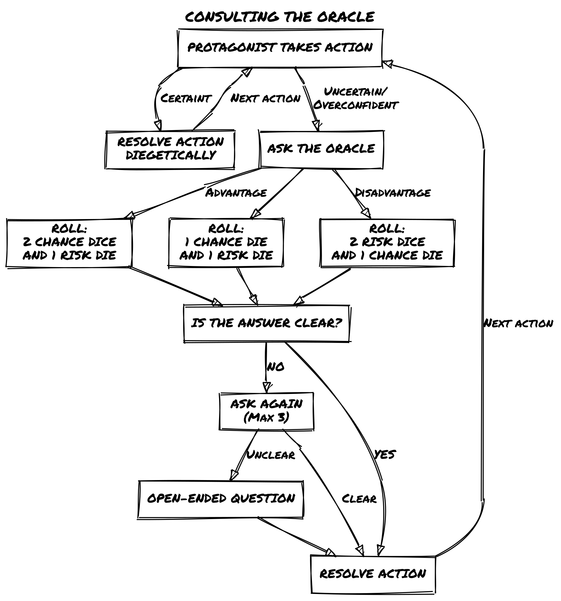
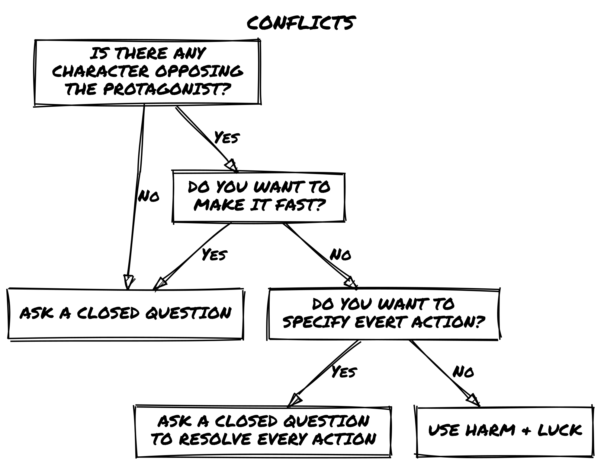

# Loner - Core Rules

## What is Loner?

***Loner*** is a minimalist Solo Role Playing Game designed to be played with only one character (the Protagonist). You'll guide them through the story that will unravel during the game, asking closed questions to an Oracle which will help you overturn your expectations. 
Every now and then you will be surprised with an unexpected twist!

*Loner* follows the following design principles:
1. **Portable**: to play you will need a few common (six-sided) dice and writing materials. Anything else is optional and not essential.
2. **Rules-Light**: the game relies on a few rules and only one solving mechanic, easy to learn and eventually to memorize.
3. **Tag-based**: characters and situations are defined only by qualitative descriptors and no quantitative characteristics.
4. **Generic**: you can play anything, yet the game is not universal. It is designed for quick resolutions, without tactical depth or simulationist ambitions.

## What is a Role Playing Game (RPG)?
A role-playing game (RPG) is a type of game in which players assume the roles of fictional characters and act out their actions and decisions within a narrative or imaginary setting. The outcome of these actions and decisions is often determined by a set of rules and game mechanics, such as dice rolls or statistical attributes of the characters. Players may also collaborate to create a shared story or narrative through their characters' actions and interactions.

## What is a Solo RPG?

In a solo RPG a single player takes on the roles of one or more characters, while also simultaneously managing some elements of the game world. These games typically involve the use of a rule system and game mechanics to determine the outcome of actions taken by the player-controlled characters. 
Unlike a gamebook (such as the Fighting Fantasy, Lone Wolf, and Tunnels & Trolls series) a solo RPG is not a form of interactive, forked narrative in which outcomes are pre-determined and limited by the author's choices.

Through the interaction of player, oracle, tools, and prompts, the character's actions will build an **emergent narrative** within whose boundaries anything can be attempted, without predetermined limits.

## Safety Tools
You will play alone, but be sure to play in an environment that is comfortable for you, without overexerting yourself, and reserve the option to stop as soon as you feel uncomfortable for any reason, physical or emotional. Don't be afraid to tackle new themes, but do so in full awareness of your boundaries.

## Minimum Requirements
To play *Loner* you will need:
- **4 six sided dice** (also known as d6s): two pairs of different colors
- **Paper and writing tools**: at least a sheet of scrap paper and and pencil, but index cards or sticky notes are a fine addition
- **Character sheet**: you may use the provided sheet at the back or a simple index card.
- **Notebook**: *Loner* is not a solo journaling game, you can easily play it in the "theater of mind". But you can keep track of you game if you feel the need!

## Choose a genre or setting
A Loner adventure takes place in a well-defined imagery that you will have to choose from: your favorite TV series, a book saga you are reading, an RPG setting you like, a genre you are familiar with or instead want to start exploring.

You can also consult lists of tropes (google them) to generate randomly and then choose!

Or you can use the Adventure Packs found in the second part of the volume.

You can also generate the character first, based on randomly chosen tropes, and once it is defined, you can follow the genre that emerged at this stage.

## Make Your Protagonist
Once the setting is established, now is the time to create your Protagonist.

Your Protagonist is described by some fixed traits:

- **Name**: the name should be iconic and consistent with the tone and setting of the story
- **Concept**: A concise description of the character's profession, background, and abilities. The best are adjective-name pairings, like *"Venturous Smuggler"* or *"Child Prodigy"*.
- **Skills** (x2): abilities not necessarily character-specific but not characteristics common to all. *"Smart"* is not a skill, *"Engine Whisperer"* is.
- **Frailty**: something that could potentially get in the way of the character, either physically, mentally, or socially.
- **Gear** (x2): particular equipment supplied to the character in coherence with the setting. Everyday items are taken for granted and do not fall under this trait.
- **Goal**: the long-term objective.
- **Motive**: what drives the pursuit of the goal.
- **Nemesis**: a person or organization that hinders the protagonist. It can emerge during the first game sessions, it may or may or not be the direct antagonist of the story, ready to appear to make life even more difficult
- **Luck**: The measure of a character's ability to avoid ill fortune or an inauspicious outcome. It applies only in Conflicts and automatically recharges when they end. Luck starts and caps at 6.

**Example**
> **Zahra Nakajima** Witty Street Cat. Streetwise, Nimble, Merciful.  
>  Knife, Low O2 Supplement.  
> She wants to obtain unknown technology to save her planet from atmosphere collapse.  
> **Nemesis**: The Naturalist Order  
> **Luck**: 6

## Everything is a Character!

In *Loner* Non-Playing Characters (NPCs), Foes, Organizations, Monsters, and even relevant objects like vehicles are characters too!

- **Living Character** follow the same rules of generation as the Protagonist.
- **Non-Living Characters**, instead, do not have a goal, a motive, nor a nemesis.

**Example**
> **The Century Skylark** Spacecraft in bad shape. Hyperjump Drive, Camouflage Circuits, Midlife Courier.  
> Shields, Turrets.  
> **Luck**: 6.

## Descriptive Tags

Tags are descriptive words or phrases that could be identify anything in the game world. They fall roughly into the following categories:
- **Character Traits**: as seen above, they describe a character's skills and flaws, their goal and motive.
- **Details**: features of an environment or scene that might change as a result of an action.
- **Conditions**: are physical, mental or social effects that impact the way a character behaves or attempts actions. 

Tags determine if there are sufficient prerequisites in the scene for [Advantage or Disadvantage](#advantage-and-disadvantage). They are qualitative representations. **They are not quantitative measures**.

## Before the Adventure
You can start directly to play your adventure, but it may be worthwhile to make an extra effort.

By defining your Protagonist's Nemesis you have already identified an **NPC**! Write down their sheet and keep it aside.

Think about whether your Protagonist has allies or friends and throw down their sheets as well.

Jot down these NPCs in a list, which you will consult when they need to be recalled as a result of a [Twist](#determine-the-twist).

Also, it might be useful to jot down interesting **Locations** that serve as settings for your Protagonist and keep a list of major **Events** that happen during the game.

## Start Your Game

To begin an adventure in Loner you will need to determine the initial scene: 

1. You might think of a dramatic situation and start the game in the middle of an action scene. This will push events forward, allowing you to build the story as you go.
2. Otherwise, if you prefer to define a framework for the adventure you can answer the classic questions, Who? What, Why? Where? How? Add also an Obstacle to overcome.

If you find it difficult to answer any or all of the questions, the following table provides prompts on which to build your adventure.

| D6 |  Who? The proposer   | What? The mission | Why? The incentive | Where? The target |        How? The seed       | Obstacle? The complication |
|:--:|:-----------------------:|:--------------------:|:---------------------:|:--------------------:|:-----------------------------:|:-----------------------------:|
|  1 |        Authority        |        Rescue        |          Help         |        Person        |        Casual encounter       |           Opposition          |
|  2 |       Organization      |      Protection      |        Fortune        |         Group        |        Old acquaintance       |           Deception           |
|  3 | Ally (friend, relative) |        Exploit       |       Coercion        |       Treasure       |             Rumors            |          Environment          |
|  4 |          Mentor         |        Explore       |        Impulse        |       Location       |            Capture            |            Disguise           |
|  5 |       Help-seeker       |        Escape        |        Ambition       |       McGuffin       |             Mishap            |              Time             |
|  6 |       Blackmailer       |        Pursuit       |        Revenge        |      Confession      | Object (map, journal, letter) |             Space             |

**Example**  
> **Who?** Mentor  
> **What?** Exploit  
> **Why?** Help  
> **Where?** McGuffin  
> **How?** Rumors  
> **Obstacle?** Time  
> Tobias Wethern took Zahra under his wing when her parents died. That's why she can't say no to him now. Tobias wants Zahra to steal a datapad from the Leton Corporation's subsidiary. He doesn't know precisely where it is stored, but that in 24 hours it will be taken from the company's security corps to be transferred to another location.

## Keep The Action In Motion

A game in *Loner* is a succession of scenes. 
A scene is a unit of time in which a certain action takes place in pursuit of a certain short-term goal. 

In *Loner* at each scene:
1. **Identify what you expect from the scene**. Compared to traits, goal, and motivation determine the Protagonist's action. What might be the reaction of the game world?
2. **Test your expectations**. When you are uncertain (or overconfident) about the reaction to your actions, [ask the Oracle](#consulting-the-oracle) a closed question (answer is Yes or No), considering the tags involved to determine if there is an [Advantage or Disadvantage](#advantage-and-disadvantage).
3. **Interpret the result**. Is the Oracle's answer in line with your expectations? If not, in the context in which the scene takes place, how should an answer that subverts them be considered?

This sequence will come to you naturally after some practice. Use it as a guideline the first few times.

## Identify Your Expectations
The Protagonist's traits characterize their behavior within the fictional world and suggest the possible actions they takes in the situational context of the scene.

Based on this, you can expect the world to react in the most logical way, and you will formulate a question that tests this expectation.

An expectation does not necessarily automatically lead to a question, which you need to ask only when there are concrete risks or you want to be amazed. In other cases, simply let events happen.

**Example**  
> Zahra sneaks into the Leton Corporation subsidiary. The expectation is that the place will be well guarded during the day and less so at night. To escape an inevitable head-on collision, Zahra decides to act at night and enter through the ventilation ductsYou don't expect there to be an alarm but maybe it's worth asking the question!

## Consulting the Oracle

When you need to test your expectations you'll ask the Oracle a closed question.

You’ll need 2d6 in one color (**Chance Dice**), and 2d6 in another (**Risk Dice**).

To resolve a closed question, roll one **Chance Die** and one **Risk Die**:
- If the Chance Die is highest, the answer is **Yes**. 
- If the Risk Die is highest, the answer is **No**.
- If both are low (3 or less), add a **but...**. 
- If both are high (4 or more), add an **and...**.
- If both are equal, the answer is **Yes, and...**. Add a point to the **[Twist Counter](#twist-counter)**.

| Dice Value |    Chance Die > Risk Die   | Risk Die > Chance Die |
|:----------:|:--------------------------:|:---------------------:|
|  Both < 4  |         Yes, but...        |       No, but...      |
|  Both > 3  |         Yes, and...        |       No, and...      |
| Mismatched |             Yes            |           No          |
|            |                            |                       |
|    Equal   | Add 1 to the Twist Counter |                       |

**Example**
> You ask, “Does Zahra manage to force the hatch?” You roll one Chance Die and one Risk Die and get (5) [4]). The answer is **Yes**, because the Chance Die is higher. You also add **And**, because both rolls are 4 or higher. If the Risk Die had come up as [3], it would have been a plain **Yes** instead.

## Advantage and Disadvantage

If circumstances or positive tags grant an advantage, add a **Chance Die** to the roll. Otherwise, when hindrances or negative tag cause a disadvantage, add a **Risk Die**. In both cases keep only the higher die of the added type when you check the roll.

Consider tags **intuitively and not quantitatively**, using the context of the situation at play. It is important to keep the flow of play fast and not accounting for advantages and disadvantages numerically!

**Example**
> You ask, "Does Zahra hack the datapad?" You roll one Chance Die and two Risk Die, as Zahra does not have any advantage in hacking and the datapad is the mission goal, compromising it would cause the mission to fail. You get (5) [3] [4]. You discard the lower Risk Die [3] and keep (5) and [4]. You obtain a **Yes** and add a **And** since they are both 4 or higher.

## Interpreting the Oracle

Always interpret the Oracle's answer in relation to the context of the game situation:

- Answers without modifiers are straightforward answers without uncertainty. They are also the least interesting to continue the story.
- Answers with modifiers (but.../and...), on the other hand, require you to make the effort to identify what new situation triggered the consultation.

**Example**  
> The datapad is hacked *and...* the information contained is not just about illicit activities of the Leton Corporation... There is more!

## Sibylline Responses

The Oracle might sometimes give answers that don't make sense in the context of the scene. Don't be tempted to detail the answer with too many questions in sequence. Three questions should be sufficient. If you're still stuck, try using an open-ended question to unlock yourself or interpret the answer as "Yes, But..." and move the story forward.

## Twist Counter

The Twist Counter is a measure of the rising tension in the narrative. At the beginning is set to 0. Every time a double throw (dice are equal) happens, add 1 to the Counter. If the Counter is below three, consider the answer as "**Yes, but...**". Otherwise a **Twist** happens and resets the Counter.

**Example**
> You ask if the datapad contains sensitive data about Wethern's illicit activities. You roll (4) [4]. The answers is "Yes, but...". Zahra finds a note about a scapegoat to frame for the theft. Could it be her?
> You also add 1 to the Twist Counter. But the counter was already at 2, so also a twist happens! The counter resets to 0.

## Determine the Twist

Roll 2d6 and consult the following Twist Table to determine what kind of twist happens. 

| D6 |      Subject       |        Action       |
|:--:|:------------------:|:-------------------:|
|  1 |    A third party   |       Appears       |
|  2 |      The hero      | Alters the location |
|  3 |    An encounter    |    Helps the hero   |
|  4 |  A physical event  |   Hinders the hero  |
|  5 | An emotional event |   Changes the goal  |
|  6 |      An object     |    Ends the scene   |

Interpret the two-word sentence in the context of the current scene. Twists will keep the plot and events going in unexpected ways.

> Now Zahra knows the content of the datapad, but you roll 1 and 5 on the Twist Table "*A third party*", "*Changes the goal*". An agent of the Leton Corporation appears before Zahra with a proposal....

## Conflicts

A *Conflict* is any situation in which opponents clash, attacking, defending, or wearing each other down in order to win.
This applies both in a practical and metaphorical sense. 

So, a Conflict is not only limited to combat (or fighting) in the strict sense but also to competitive situations (such as contests, duels, verbal confrontations, etc.) in which two or more characters (including vehicles, of course!) compete.

Conflicts can be resolved in different ways depending on preferences and context:
1. Ask a single closed question. The Oracle's answer determines the outcome of the conflict.
2. Ask a series of closed questions to resolve current single actions.
3. Use the rules of Harm & Luck below.

Note that the Twist Counter **does not apply** to Harm & Luck. Instead, it is used regularly if the Conflict is handled with closed questions.

## Harm & Luck

If the conflict is resolved by applying damage to the Luck trait, roll the dice to determine whether the protagonist causes damage to the opponent or suffers damage due to counterattack or failed defense. The rolls are player facing only.

The damage reduces the Luck of the target, whether protagonist or NPC. When the Luck runs out, the character has lost the conflict.

The final outcome depends on the context. Do you get caught? Are you seriously injured? You may even die if that fits the narrative.

| Answer      | Do you get what you want?                               | Harm    |
| ----------- | ------------------------------------------------------- | ------- |
| Yes, and... | You get what you want, and something else.              | Cause 3 |
| Yes...      | You get what you want.                                  | Cause 2 |
| Yes, but... | You get what you want, but at a cost.                   | Cause 1 |
| No, but...  | You don’t get what you want, but it’s not a total loss. | Take 1  |
| No...       | You don’t get what you were after.                      | Take 2  |
| No, and...  | You don’t get what you want, and things get worse.      | Take 3  |

**Example**
> Zahra confronts a thug in an alley. He is "Martial Artist", "Hand-to-Hand Combat", "Feline" and "Short". Zahra tries to hit him with the knife, you throw (5) (6) [4] ("**Yes, And...**", causing a Luck loss of 3 to the thug). The thug throws a roundhouse kick at Zahra (roll (3) (2) [2], "**Yes, but...**", causing a Luck loss of 1 to Zahra). Who will win?

## Determine the mood of the next scene

At the end of the current scene sometimes you will be clear about the direction to take, other times you may need to determine the general mood of the next one. In this case roll 1d6 and consult the following table:

|  D6 |   Next Scene   |
|:---:|:--------------:|
| 1-3 | Dramatic scene |
| 4-5 |   Quiet Scene  |
|  6  |   Meanwhile…   |

- A **dramatic scene** does not break the tension of the previous scene but carries it further forward, introducing further obstacles or difficulties.
- During a **quiet scene** there is time to take a breath, to heal, to make plans for the next steps and to deepen relationships.
- A **meanwhile scene** takes place somewhere else, other than where the hero is. It cuts to villains or other plot-important characters.

**Example**
> Zahra accepts the proposal, you now roll for the next scene: 6, *Meanwhile scene*. In the following scene, Tobias Wethern hires a hit man to kill Zahra...

## Open-Ended Question or Get Inspired

To answer an Open-Ended question, roll 1d6 once on each of the following tables (roll at least a verb and a noun, adjectives are optional).

| Verbs |     1    |    2   |    3    |     4    |    5    |    6    |
|:-----:|:--------:|:------:|:-------:|:--------:|:-------:|:-------:|
|   1   |  inject  |  pass  |   own   |  divide  |   bury  |  borrow |
|   2   | continue |  learn |   ask   | multiply | receive | imagine |
|   3   |  develop | behave | replace |  damage  | collect |   turn  |
|   4   |   share  |  hand  |   play  |  explain | improve |  cough  |
|   5   |   face   | expand |  found  |  gather  |  prefer |  belong |
|   6   |   trip   |  want  |   miss  |    dry   |  employ | destroy |

| Adjectives |      1      |       2       |     3     |       4       |      5      |     6     |
|:----------:|:-----------:|:-------------:|:---------:|:-------------:|:-----------:|:---------:|
|      1     |   frequent  |     faulty    |  obscene  |     scarce    |    rigid    | long-term |
|      2     |   ethereal  | sophisticated |  rightful | knowledgeable | astonishing |  ordinary |
|      3     | descriptive |   insidious   |    poor   |     proud     |  reflective |  amusing  |
|      4     |    silky    |   worthless   |   fixed   |     loose     |   willing   |    cold   |
|      5     |    quiet    |     stormy    |   spooky  |   delirious   |    innate   |    late   |
|      6     | magnificent |    arrogant   | unhealthy |    enormous   |  truculent  |  charming |

| Nouns |      1     |    2    |    3   |    4   |     5     |     6    |
|:-----:|:----------:|:-------:|:------:|:------:|:---------:|:--------:|
|   1   |    cause   |  stage  | change |  verse |   thrill  |   spot   |
|   2   |    front   |  event  |  home  |   bag  |  measure  |   birth  |
|   3   |    prose   |  motion |  trade | memory |   chance  |   drop   |
|   4   | instrument |  friend |  talk  | liquid |    fact   |   price  |
|   5   |    word    | morning |  edge  |  room  |   system  |   camp   |
|   6   |     key    |  income |   use  |  humor | statement | argument |

**Example**
> You ask: "Does Zahra have friends to ask for help against the hit man?". You roll 24 and 32: *multiply motion*. Zahra needs to move quickly to reach Melina Reade, a hacker with contacts in the underworld who might be able to help her!

## When the story ends

At the end of the adventure you may add another trait to the character. It is better that this is related to how the story just ended and can be either a Skill, Gear, a new Frailty, or even a new Nemesis! You can also modify an existing trait to better represent an enhanced expertise.

Also update the list of **NPCs**, **Locations**, and **Events** that may show up again in future adventures.

**Example**
> Zahra secures the datapad in the hands of the authorities, framing both Wethern and the Leton Corporation. Wethern is arrested, but she has gained a powerful enemy working against the Corporation. She gains "Wannabe Hacker" to her skills. Maybe Melina can mentor her!

## Loner Together
Loner's rules are designed for a single player controlling one character.
However being derivative of a multiplayer game (Freeform Universal) no one prevents you from using them for group play as well, if you insist on doing so.

It is then possible to play in the following modes:
1. **without a game master**: you play as in solo mode, each person controls their own character and asks questions to the Oracle in solo play. The Oracle's answers and the game world's reactions are interpreted by the player who asks the current question. Facilitator functions (moderating the flow of play and possibly settling disputes between players, as well as reminding players of the rules) can be taken on by a single player at the table, or they can be rotated. Questions pertaining to the entire group of character can be concerted.
2. **with a game master**: they always pull only the players questioning the Oracle as in the solitary, no-master mode. The master takes charge of interpreting the answer and presenting the reactions of the game world. He also assumes the functions of a facilitator.

Keep in mind that as much as Loner can be played in groups, I strongly recommend that you use Freeform Universal for this need.

## The Adventure Maker
Sometimes you may lack the inspiration to think of a game setting, or you want to experiment with one you have never thought of.
The tables below are designed to instantly generate an unpredictable setting for you to explore with a game.

To generate a setting:
1. Roll on the Settings table
2. Roll on the Tones table
3. Roll two times on one Things table of your choice

To generate a premise of adventure:
1. Roll on the Opposition table
2. Roll two times on Actions table and on a Things tables

Note that the adventure premise is not the initial scene prompt, only the framework within which it takes place.

### Table 1: Settings

|     | 1                                    | 2                       | 3                         | 4                                 | 5                                 | 6                           |     |
| --- | ------------------------------------ | ----------------------- | ------------------------- | --------------------------------- | --------------------------------- | --------------------------- | --- |
| 1   | Post-Apocalyptic Wasteland           | High Fantasy Kingdom    | Medieval War and Intrigue | Cyberpunk Megacorporation         | Futuristic Space Colony           | Supernatural Noir City      |     |
| 2   | Alternate History                    | Pirate-Filled Seas      | Wild West Frontier        | Dark Fantasy Realm                | Futuristic Dystopian City         | Ancient Greek Mythology     |     |
| 3   | Space Opera Adventure                | Samurai-Era Japan       | Zombie Survival           | Superhero Metropolis              | Cold War Espionage                | Modern Crime Syndicate      |     |
| 4   | Magic School for Young Mages         | Horror-Filled Asylum    | Epic Fantasy Quest        | Cybernetic Organisms and Androids | Lovecraftian Cosmic Horrors       | Sword and Sorcery Adventure |     |
| 5   | Urban Fantasy Underworld             | Abandoned Space Station | Colonial America          | Mythical Creatures and Legends    | Martial Arts Action               | Horror-Stricken Carnival    |     |
| 6   | Underwater Adventure and Exploration | Jungle-Covered Planet   | Steampunk Victorian Era   | Time Travel Paradoxes             | Intergalactic Starfighter Battles | Survival in a Savage Land   |     |
|     |                                      |                         |                           |                                   |                                   |                             |     |

### Table 2: Tones

|     | 1-2                                | 3-4                       | 5-6                          |
| --- | ---------------------------------- | ------------------------- | ---------------------------- |
| 1   | Dark and brooding                  | Lighthearted and humorous | Gritty and realistic         |
| 2   | Epic and grandiose                 | Suspenseful and thrilling | Mysterious and enigmatic     |
| 3   | Action-packed and adventurous      | Romantic and whimsical    | Horror-filled and terrifying |
| 4   | Technologically advanced and sleek | Grungy and dirty          | Gothic and ominous           |
| 5   | Surreal and dreamlike              | Futuristic and dystopian  | Nostalgic and timeless       |
| 6   | Eerie and paranormal               | Martial and disciplined   | Gracious and elegant         |

### Table 3: Things

|     |           1           |          2          |           3          |           4          |           5           |          6          |
|:---:|:---------------------:|:-------------------:|:--------------------:|:--------------------:|:---------------------:|:-------------------:|
|  1  |         Magic         |       Monsters      |    Ancient relics    |    Medieval castle   | Futuristic technology |      Spaceship      |
|  2  |     Ancient ruins     | Forbidden knowledge |    Secret society    |    Dangerous quest   |  Band of adventurers  |    Unseen forces    |
|  3  |    Hidden treasure    |      Dark magic     |  Mystical creatures  |  Supernatural powers |      Epic battle      |   Intriguing plot   |
|  4  | Suspicious characters |    War-torn land    | Dangerous wilderness |  Political intrigue  |    World domination   | Suspenseful journey |
|  5  |      Dark secrets     |    Forbidden love   |   Intense conflict   | Death-defying stunts |   Powerful artifacts  |    Epic journeys    |
|  6  |  Unpredictable twists |  Dynamic characters |  Different factions  |     Vast empires     |      Epic heroes      | Legendary creatures |

|     |              1             |            2            |            3           |           4           |           5           |              6             |
|:---:|:--------------------------:|:-----------------------:|:----------------------:|:---------------------:|:---------------------:|:--------------------------:|
|  1  | Post-apocalyptic wasteland |   Steampunk cityscape   |  Dragon-infested skies |    Haunted mansion    | Futuristic metropolis | Intergalactic trade routes |
|  2  |      Lost city of gold     | Artificial intelligence |      Pirate's cove     |  Time-travel paradox  |       Espionage       |   Extraterrestrial beings  |
|  3  |     Underwater kingdom     |     Epic sea voyage     |   Superheroic powers   |       Time loops      |  Alternate realities  | Virtual reality simulation |
|  4  |     Intriguing mystery     |     Mutant uprising     | Advanced biotechnology |   Futuristic society  |   Alternate history   |     Cyberpunk dystopia     |
|  5  |       Extensive lore       |    Unstoppable virus    |    Enchanted forest    | The unknown frontiers |   Advanced robotics   |   Secrets of the universe  |
|  6  | End of the world scenarios |  Telekinetic abilities  |   Futuristic weapons   |   Dimension hopping   |     Techno-sorcery    |    Superpowered conflict   |

|     |             1            |           2          |             3             |             4             |            5            |             6             |
|:---:|:------------------------:|:--------------------:|:-------------------------:|:-------------------------:|:-----------------------:|:-------------------------:|
|  1  |     Lost civilization    |  Decaying metropolis |       Gothic horror       |     Wild west frontier    | Futuristic cyberwarfare |     Space exploration     |
|  2  |    Political uprising    | Artificial lifeforms | Mercenaries and assassins | Time-traveling adventures |    Espionage mission    |       Alien invasion      |
|  3  |   Underwater adventure   |      Epic siege      |     Magical abilities     |       Time anomalies      |    Alternate timeline   | Virtual reality nightmare |
|  4  |   Intriguing conspiracy  |   Mutant insurgency  |  Cybernetic enhancements  |     Futuristic utopia     |  Historical reimagining |    Cyberpunk rebellion    |
|  5  | Extensive world-building |  Unstoppable monster |     Enchanted kingdom     |     The final frontier    |    Robotic revolution   |  Secrets of the ancients  |
|  6  | End of the era scenarios |   Psionic abilities  |  Futuristic battlefields  |  Interdimensional portals |       Technomancy       |   Superpowered diplomacy  |

### Table 4: Actions

|     |      1      |     2    |      3     |     4     |     5     |    6    |
|:---:|:-----------:|:--------:|:----------:|:---------:|:---------:|:-------:|
|  1  |     Cast    |  Battle  |   Free  |  Explore  |  Upgrade  |  Pilot  |
|  2  |   Decipher  |   Seek   | Infiltrate |  Complete |    Join   | Uncover |
|  3  |     Find    |  Master  |    Tame    |  Harness  |    Win    | Unravel |
|  4  | Interrogate | Navigate |   Survive  | Influence | Overthrow |  Endure |
|  5  |   Guess   |  Pursue  |   Resolve  |  Perform  |  Acquire  |  Embark |
|  6  |  Anticipate |  Develop |    Ally    |   Expand  |   Become  |   Slay  |

### Table 5: Oppositions

|     |           1          |          2          |             3            |           4           |          5          |           6          |
|:---:|:--------------------:|:-------------------:|:------------------------:|:---------------------:|:-------------------:|:--------------------:|
|  1  |     Dark wizards     |    Savage beasts    |    Malevolent spirits    |   Arrogant noblemen   |   Dangerous traps   |   Ruthless bandits   |
|  2  |     Undead armies    | Corrupt politicians |  Sinister organizations  |    Vicious monsters   | Treacherous terrain |    Despotic rulers   |
|  3  |  Powerful artifacts  | Merciless assassins |    Dangerous creatures   |     Ancient curses    |   Complex puzzles   |    Powerful spells   |
|  4  | Ruthless mercenaries |     Dark forces     |     Terrible secrets     |    Insidious plots    |  Vicious predators  | Unforgiving elements |
|  5  |     Lethal poison    |  Ancient prophecies | Irresistible temptations | Powerful enchantments |  Ruthless warlords  |    Unseen dangers    |
|  6  |    Terrible curses   |    Devious traps    |   Sinister conspiracies  |  Dangerous illusions  | Malevolent entities |   Ruthless factions  |

## Credits

- [Recluse Engine](https://gravenutterance.itch.io/recluse) (CC BY 4.0) by Graven Utterance and Tiny Solitary Soldier Oracle for the main resolution and scene mechanics.
- [Freeform Universal Roleplaying Game](https://www.perilplanet.com/freeform-universal/) (CC BY 4.0) by Nathan Russell as an inspiration of the whole game and the character traits.
- Harm mechanics are from [6Q System](https://chaosmeister.itch.io/6-q-system) (CC BY 4.0) by Marcus Burggraf.
- Tana Pigeon for [Mythic](https://www.wordmillgames.com/mythic.html) and clarifying for me the mechanisms of expectation and testing.
- S. John Ross for [Risus](https://www.risusrpg.com/) and to have taught me the beauty of clichés and that not all conflicts are combat.
- The Adventure Maker setup is inspired from *The Instant Game* by Animalball Partners (2007). None of its content is used here.

With deepest thanks to :
- Shane Conner for proof reading and revision of the text of the First Edition.
- the Italian solo player community for their constant support and drive to improve the game.

## License

Loner v.2.3

(CC) 2023 Roberto Bisceglie

This work is licensed under the Creative Commons Attribution-ShareAlike 4.0 International License. To view a copy of this license, visit http://creativecommons.org/licenses/by-sa/4.0/ or send a letter to Creative Commons, PO Box 1866, Mountain View, CA 94042, USA.