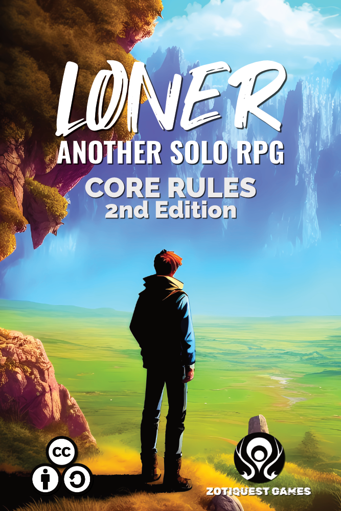
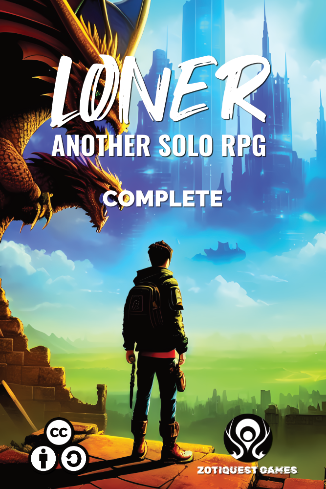
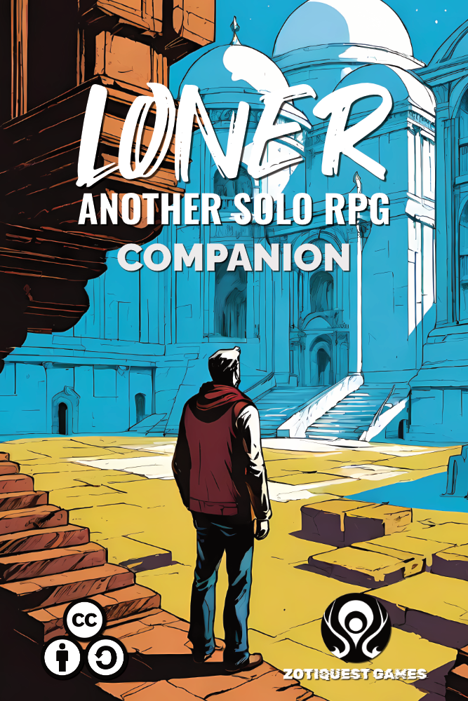
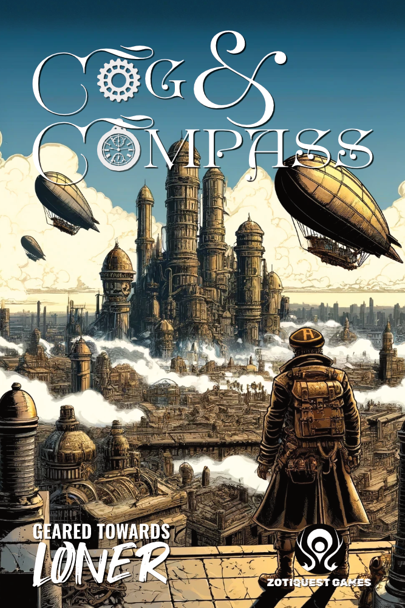
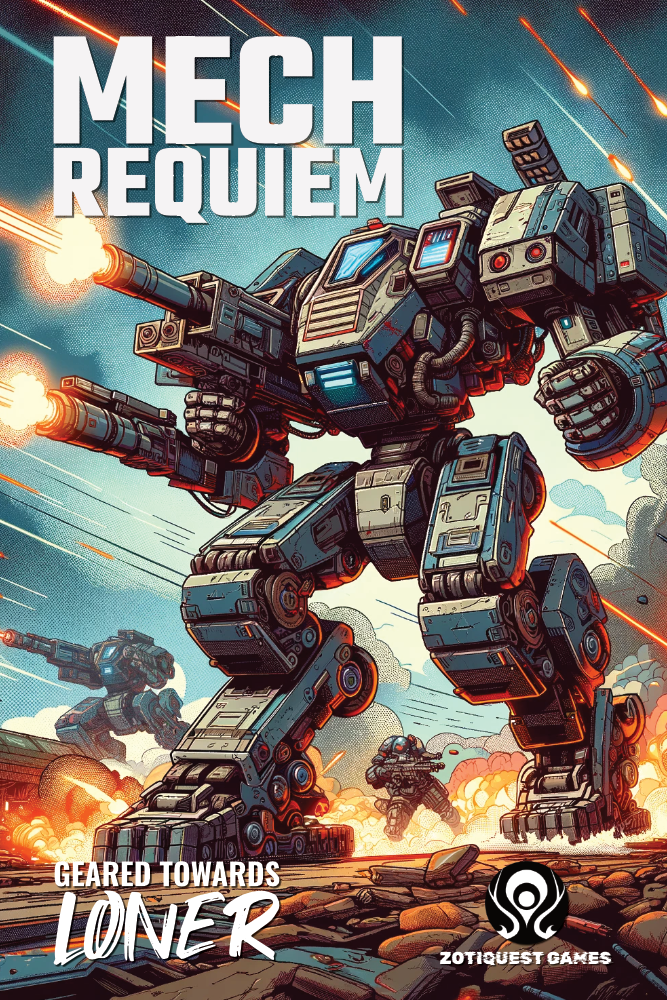
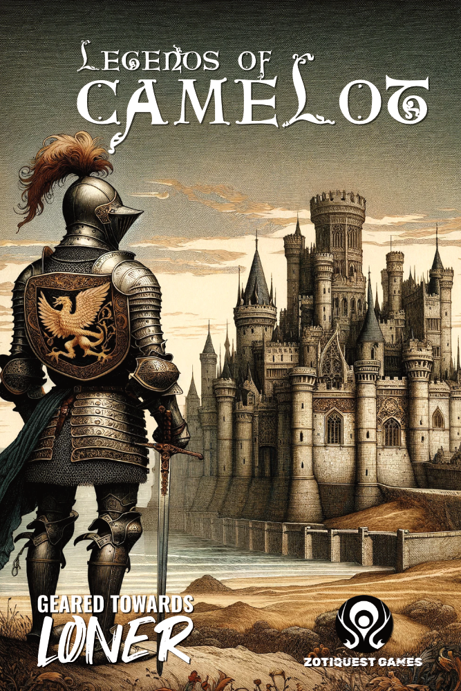
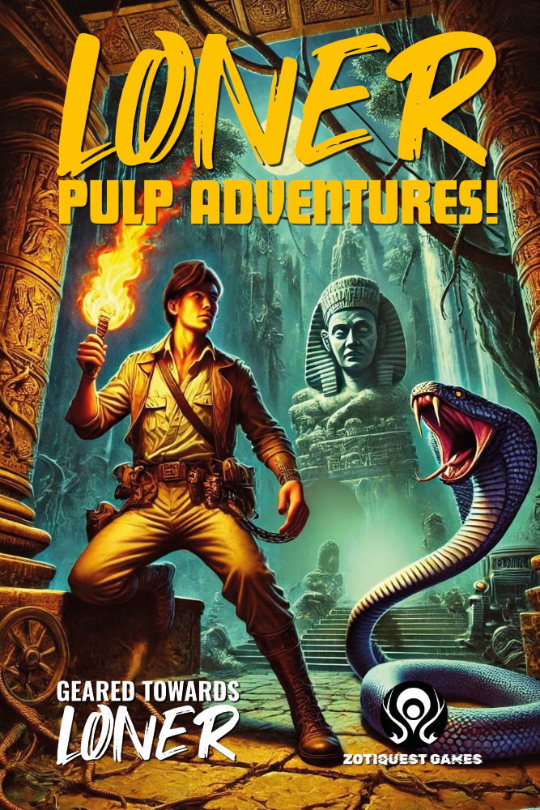
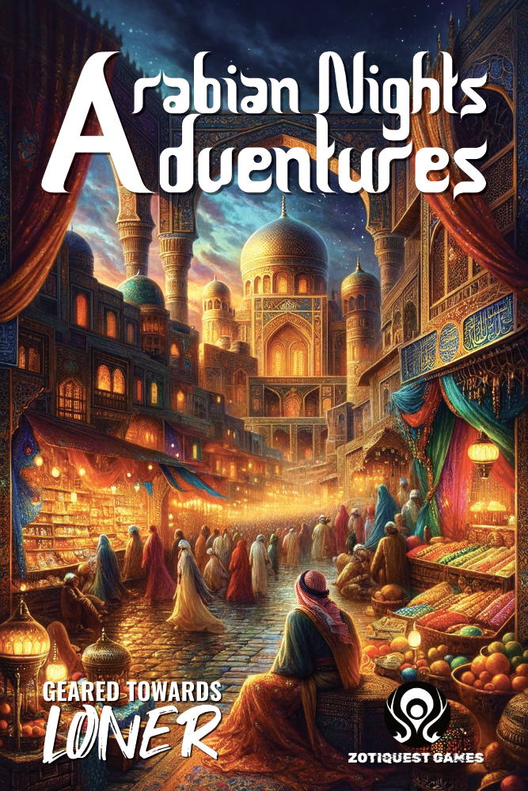

# Loner
## Another Solo RPG

© 2023 Roberto Bisceglie

> *Tonight your playgroup couldn't get together and you're dying to play?*  
> *Or you may not even have a group or maybe you don't even want to have one!*  
> *Good news: solo roleplaying is possible!*

**Loner** is a minimalist solo game that will allow you to have amazing adventures in any genre and setting with two pairs of dice and only your imagination as the limit!

Based on [Freeform Universal](https://www.perilplanet.com/freeform-universal/), this revised second edition is the result of player feedback and is designed to introduce even the neophyte to solo RPG.

Complete with tips, diagrams and examples, you can dive into endless worlds of adventure in a few minutes.

Explore them with your Protagonist through the Oracle-led emergent narrative and be amazed by the unexpected twists and turns.

---

Loner is a product of [**Zotiquest Games**](https://zotiquestgames.com)

<!-- <iframe frameborder="0" src="https://itch.io/embed/1908947" width="552" height="167"><a href="https://zeruhur.itch.io/loner-2nd-edition">Loner (2nd Edition) by Zotiquest Games</a></iframe> -->

## Core Rules

    

    
        

            <h2><b>Core Rules</b></h2>
            

                The <b>Core Rules PDF is downloadable for free.</b> The softcover is only 6$ on Amazon. All you need to play is here, the rest is optional.
            

            

                <a href="https://zeruhur.itch.io/loner-3rd-edition" target="_blank" class="w3-btn w3-black w3-hover-white">PDF (itch.io)</a>
                <a href="https://www.drivethrurpg.com/en/product/427674/loner-core-rules-3rd-edition" target="_blank" class="w3-btn w3-black w3-hover-white">PDF (DriveThruRPG)</a>
                <a href="https://www.amazon.com/dp/B0DWSH9X1B" target="_blank" class="w3-btn w3-black w3-hover-white">Softcover (Amazon)</a>
            

            

    
        
    

    
        

            <h2><b>Loner Complete</b></h2>
            

                <b>Loner Complete</b> contains the <b>Core Rules 2e</b> + 12 Adventure Packs, tight supplements that kick off your experience with Character Traits, NPCs, Factions, Locations and Adventure Seeds! Over 300 pages of content in popular genres like Fantasy, Sci-fi, Horror but also Cyberpunk, Western, Post-Apoc and much more!
            

            

                <a href="https://zeruhur.itch.io/loner-3rd-edition" target="_blank" class="w3-btn w3-black w3-hover-white">PDF (itch.io)</a>
                <a href="https://www.drivethrurpg.com/en/product/456768/loner-complete" target="_blank" class="w3-btn w3-black w3-hover-white">PDF (DriveThruRPG)</a>
                <a href="https://www.amazon.com/dp/B0CKRXZPWG" target="_blank" class="w3-btn w3-black w3-hover-white">Softcover (Amazon)</a>
            

        

    

    
        

            <h2><b>Loner Companion</b></h2>
            

                Coming Soon
            

            

                <a href="https://zeruhur.itch.io/loner-3rd-edition" target="_blank" class="w3-btn w3-black w3-hover-white">PDF (itch.io)</a>
                <a href="https://www.drivethrurpg.com/it/product/502020/loner-companion" target="_blank" class="w3-btn w3-black w3-hover-white">PDF (DriveThruRPG)</a>
                <a href="https://www.amazon.com/dp/B0DMVS5MVQ" target="_blank" class="w3-btn w3-black w3-hover-white">Softcover (Amazon)</a>
            

        

    

## Geared Towards Loner Games

A new generation of Adventure Packs: self-contained, stand-alone games with all the basic rules plus everything you need to play in a specific adventure world!

    

    
        

            <h2><b>Loner: Kwaidan!</b></h2>
            

                Embark on a solitary sojourn into the supernatural mysteries of old Japan. Where spirits and shadows loom, and brave heroes rely on wit and skill to survive the night.
            

            

                This comprehensive Adventure Pack for Loner unlocks the fantastical world of Kwaidan, capturing all the richness of Japanese folk legends tailored for solo adventuring.
            

            

                <a href="https://zeruhur.itch.io/loner-kwaidan" target="_blank" class="w3-btn w3-black w3-hover-white">PDF (itch.io)</a>
                <a href="https://www.drivethrurpg.com/en/product/458066/loner-kwaidan" target="_blank" class="w3-btn w3-black w3-hover-white">PDF (DriveThruRPG)</a>
                <a href="https://www.amazon.com/Loner-Kwaidan-Roberto-Bisceglie/dp/B0CX5ZBJ8M" target="_blank" class="w3-btn w3-black w3-hover-white">Softcover (Amazon)</a>
            

            

    
        
    

    
        

            <h2><b>Cog & Compass</b></h2>
            

                Welcome to the Cog & Compass Era, a time when steam technology reshapes the 19th century into a landscape brimming with mechanical marvels and industrial wonders. In this richly detailed steampunk universe, you are the protagonist in a world defined by gears, pistons, and the hiss of steam engines.            
            

            

                From the smog-choked cities of industrial magnates to the uncharted territories guarded by steam-powered automatons, your journey will take you through a reimagined Victorian era like no other. Commandeer airships that traverse the skies, navigate mighty steamboats across churning rivers, or pilot rugged steam crawlers over landscapes that stretch the limits of the imagination.
            

            

                <a href="https://zeruhur.itch.io/cog-compass" target="_blank" class="w3-btn w3-black w3-hover-white">PDF (itch.io)</a>
                <a href="https://www.drivethrurpg.com/en/product/479117/cog-compass" target="_blank" class="w3-btn w3-black w3-hover-white">PDF (DriveThruRPG)</a>
                <a href="https://www.amazon.com/dp/B0D2XSVRZK" target="_blank" class="w3-btn w3-black w3-hover-white">Softcover (Amazon)</a>
            

        

    

    
        

            <h2><b>Mech: Requiem</b></h2>
            

                In a fractured Earth of the 2300s, where advanced technology and high-tech warfare dominate, embark on a solo tabletop RPG journey like no other. Welcome to Mech: Requiem, a game that plunges you into the heart of ongoing proxy wars waged by powerful mechs.         
            

            

                Based on Loner, Mech: Requiem is designed for simplicity and immersion. All you need are a few six-sided dice and some writing utensils. With simple rules and thematic tags that define characters and scenarios, the focus remains on fast-paced action and deep storytelling.
            

            

                <a href="https://zeruhur.itch.io/mech-requiem" target="_blank" class="w3-btn w3-black w3-hover-white">PDF (itch.io)</a>
                <a href="https://www.drivethrurpg.com/en/product/484253/mech-requiem" target="_blank" class="w3-btn w3-black w3-hover-white">PDF (DriveThruRPG)</a>
                <a href="https://www.amazon.com/dp/B0D7J4B4F9" target="_blank" class="w3-btn w3-black w3-hover-white">Softcover (Amazon)</a>
            

        

    

    

    
        

            <h2><b>Legends of Camelot</b></h2>
            

                Step into the mythic realm of Camelot, where chivalric knights uphold their codes, mystical creatures roam the wilds, and ancient magic weaves through every corner of the land. In this solo tabletop RPG, you are the hero. Will you uncover the secrets of the Grail? Defend Camelot from the looming Saxon threat? Or navigate the treacherous court intrigues that could tear the kingdom apart?         
            

            

                Forge your destiny with nothing more than a few dice and your imagination. Every decision brings you closer to glory—or peril. Face legendary foes like the fearsome Red Welsh Dragon, match wits with cunning sorcerers, and uncover enchanted relics hidden in forgotten ruins. But beware: betrayal lurks behind every curtain, and even the mightiest knight can fall to temptation.
            

            

                <a href="https://zeruhur.itch.io/legends-of-camelot" target="_blank" class="w3-btn w3-black w3-hover-white">PDF (itch.io)</a>
                <a href="https://www.drivethrurpg.com/en/product/495043/legends-of-camelot" target="_blank" class="w3-btn w3-black w3-hover-white">PDF (DriveThruRPG)</a>
                <a href="https://www.amazon.com/dp/B0DH55M5WV" target="_blank" class="w3-btn w3-black w3-hover-white">Softcover (Amazon)</a>
            

            

    
        
    

    
        

            <h2><b>Pulp Adventures!</b></h2>
            

                <b>Unleash Your Inner Hero in a World of Thrills and Danger!</b>
            

            
 
                Step into the action-packed universe of Loner: Pulp Adventures!, a solo tabletop RPG inspired by the bold, daring spirit of classic pulp fiction. Explore ancient ruins, battle shadowy cults, uncover lost treasures, and navigate a world where every decision brings new challenges—and unforgettable stories.
            

            

                With simple rules and limitless possibilities, Loner: Pulp Adventures! invites you to:
            

            

                <b>Adventure Awaits. Will You Answer the Call?</b>
            

            

                <a href="https://zeruhur.itch.io/loner-pulp-adventures" target="_blank" class="w3-btn w3-black w3-hover-white">PDF (itch.io)</a>
                <a href="https://www.drivethrurpg.com/it/product/504712/loner-pulp-adventures" target="_blank" class="w3-btn w3-black w3-hover-white">PDF (DriveThruRPG)</a>
                <a href="https://www.amazon.com/dp/B0DPS536NB" target="_blank" class="w3-btn w3-black w3-hover-white">Softcover (Amazon)</a>
            

        

    

    
        

            <h2><b>Arabian Nights Adventures</b></h2>
            

                Coming Soon
            

            

                <a href="#" target="_blank" class="w3-btn w3-black w3-hover-white">PDF (itch.io)</a>
                <a href="#" target="_blank" class="w3-btn w3-black w3-hover-white">PDF (DriveThruRPG)</a>
                <a href="#" target="_blank" class="w3-btn w3-black w3-hover-white">Softcover (Amazon)</a>
            

        

    

## Web SRD
The complete text of Loner, the Adventure Packs and the Geared Toward Loner Games are available for free in web format on this site. Just navigate the navbar above!

## License

I strongly support the open source ethos.

**Loner** is based on some materials released under a Creative Commons license and likewise is distributed under a **CC-BY-SA-4.0** license: use it, hack it, make your own edition! 

The more we spread this logic of sharing and reciprocity the more widespread and free our hobby will become.

You can play online with the [Loner Assistant](https://loner.zotiquestgames.com/loner-assistant)!

