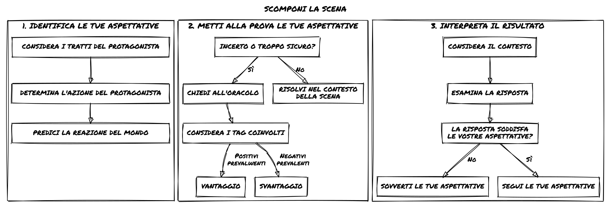
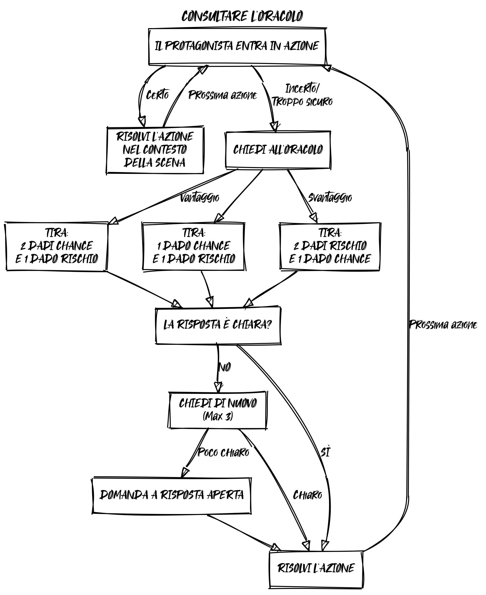
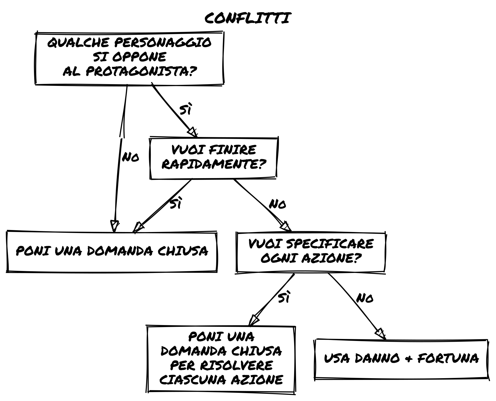

# Loner - Regole Base

## Che cos'è Loner?

***Loner*** è un gioco di ruolo solitario minimalista pensato per essere giocato con un solo personaggio (il Protagonista). Lo guiderai attraverso la storia che si dipanerà nel corso del gioco, ponendo domande chiuse a un Oracolo che ti aiuterà a ribaltare le tue aspettative. Di tanto in tanto sarai sorpreso con un colpo di scena inaspettato!

*Loner* segue i seguenti principi di progettazione:
1. **Portatile**: per giocare avrai bisogno di alcuni dadi comuni (a sei facce) e di materiale da scrittura. Tutto il resto è opzionale e non essenziale.
2. **Regole leggere**: il gioco si basa su poche regole e su un'unica meccanica di risoluzione, facile da imparare e volendo anche da memorizzare.
3. **Basato su tag**: i personaggi e le situazioni sono definiti solo da descrittori qualitativi e non da caratteristiche quantitative.
4. **Generico**: puoi giocare a qualsiasi cosa, ma il gioco **non è universale**. È progettato per risoluzioni rapide, senza profondità tattica o velleità simulazionistiche.

## Che cos'è un gioco di ruolo (GDR)?

Un gioco di ruolo (GDR) è un tipo di gioco in cui i giocatori assumono il ruolo di personaggi immaginari e agiscono e prendono decisioni all'interno di un'ambientazione immaginaria. L'esito di queste azioni e decisioni è spesso determinato da un insieme di regole e meccaniche di gioco, come il tiro di dadi o di attributi misurabili dei personaggi. I giocatori possono anche collaborare per creare una storia o una narrazione condivisa attraverso le azioni e le interazioni dei loro personaggi.

## Che cos'è un gioco di ruolo in solitario?

In un gioco di ruolo solitario (GDRS) un singolo giocatore assume il ruolo di uno o più personaggi, gestendo contemporaneamente anche alcuni elementi del mondo di gioco. Questi giochi prevedono in genere l'uso di un sistema di regole e di meccaniche di gioco per determinare l'esito delle azioni compiute dai personaggi controllati dal giocatore. 
A differenza di un librogioco (come le serie Fighting Fantasy, Lone Wolf e Tunnels & Trolls), un GDRS non è una forma di narrazione interattiva a bivi in cui i risultati sono predeterminati e limitati dalle scelte dell'autore.

Attraverso l'interazione tra giocatore, oracolo, strumenti e suggerimenti, le azioni del personaggio costruiranno una **narrazione emergente** entro i cui confini si può tentare qualsiasi cosa, senza limiti predeterminati.

## Strumenti di sicurezza

Giocherai da solo, ma sii certo di giocare in un ambiente per te confortevole, senza affaticarti eccessivamente e riservati l'opzione di interrompere appena dovessi sentirti a disagio per qualche motivo, fisico o emozionale. Non avere timore di affrontare temi nuovi, ma fallo nella piena consapevolezza dei tuoi limiti.

## Requisiti minimi

Per giocare a *Loner* avrai bisogno di:
- **4 dadi a sei facce** (noti anche come d6): due coppie di colori diversi.
- **Carta e strumenti per scrivere**: almeno un foglio di carta straccia e una matita, ma schedine o foglietti adesivi sono un'ottima aggiunta.
- **Scheda del personaggio**: puoi utilizzare la scheda fornita in fondo al libretto o una semplice scheda.
- **Quaderno**: *Loner* non è un gioco solitario diaristico, puoi facilmente giocarlo nel "teatro della mente". Ma se ne senti la necessità puoi ovviamente tenere appunti durante la tua sessione!

## Scegli un genere o un'ambientazione
Un'avventura di Loner si svolge in un immaginario ben definito che dovrai scegliere: la tua serie TV preferita, una saga di libri che stai leggendo, un'ambientazione per GDR che ti piace, un genere che conosci bene o che invece vuoi iniziare ad esplorare.

Puoi anche consultare delle liste di tropi (cerca su google!) da generare casualmente per poi decidere!

Oppure puoi usare gli Adventure Packs che trovi nella seconda parte del volume.

Puoi anche generare il personaggio per primo, sulla base di tropi scelti casualmente e una volta che l'hai definito, puoi seguire il genere emerso in questa fase.

## Crea il Protagonista
Stabilita l'ambientazione, è il momento di generare il tuo Protagonista.

Il tuo Protagonista è descritto da alcune caratteristiche:

- **Nome**: il nome dovrebbe essere iconico e consistente con il tono e l'ambientazione della storia.
- **Concetto**: una descrizione concisa della professione, del background e delle abilità del personaggio. I migliori sono i binomi aggettivo-nome, come "Contrabbandiere audace" o "Bambino prodigio".
- **Abilità** (x2): abilità non necessariamente specifiche del personaggio ma neanche caratteristiche comuni a tutti. "Intelligente" non è un'abilità, "Sussurratore di motori" lo è.
- **Debolezza**: qualcosa che potrebbe ostacolare il personaggio, sia fisicamente, mentalmente o socialmente.
- **Attrezzatura** (x2): equipaggiamento particolare in dotazione al personaggio in coerenza con l'ambientazione. Gli oggetti quotidiani sono dati per scontati e non rientrano in questa caratteristica.
- **Obiettivo**: l'obiettivo a lungo termine.
- **Motivazione**: ciò che spinge alla persecuzione dell'obiettivo.
- **Nemesi**: una persona o organizzazione che ostacola il protagonista. Può emergere durante le prime sessioni di gioco o non essere l'antagonista diretto della storia, pronto a spuntare per rendere la vita dell'eroe ancora più difficile.
- **Fortuna**: la misura della capacità di evitare la malasorte o un esito infausto da parte di un personaggio . Si applica solo nei Conflitti e si ricarica automaticamente al loro termine. La Fortuna parte da (e ha un tetto massimo di) 6 punti.

**Esempio**
> **Zahra Nakajima** Randagia Sagace. Scaltra, Agile, Compassionevole.  
> Coltello, Pillole Antisoffocamento.  
> Vuole ottenere tecnologie sconosciute per salvare il suo pianeta dal collasso dell'atmosfera.  
> **Nemesi**: L'Ordine Naturalista  
> **Fortuna**: 6

## Tutto è un personaggio!

In *Loner* anche i Personaggi Non Giocanti (PNG), i Nemici, le Organizzazioni, i Mostri e persino gli oggetti rilevanti come i veicoli sono personaggi!

- I**Personaggi Viventi** seguono le stesse regole di generazione del Protagonista.
- I **Personaggi Non Viventi**, invece, non hanno uno scopo, un movente, né una nemesi.

**Esempio**
> **The Century Skylark** Nave spaziale in cattive condizioni. Motore di Salto, Circuiti Camaleonti, Nave Corriere in male arnese.  
> Scudi, Torrette.  
> **Fortuna**: 6.

## Tag descrittivi

I tag sono parole o frasi descrittive che possono identificare qualsiasi cosa nel mondo di gioco. Si suddividono grosso modo nelle seguenti categorie:
- **Tratti del personaggio**: come visto sopra, descrivono le abilità e i difetti di un personaggio, il suo obiettivo e la sua motivazione.
- **Dettagli**: caratteristiche di un ambiente o di una scena che possono cambiare in seguito a un'azione.
- **Condizioni**: effetti fisici, mentali o sociali che influenzano il modo in cui un personaggio si comporta o tenta di compiere azioni. 

I tag determinano se nella scena ci sono prerequisiti sufficienti per ottenere [Vantaggio o Svantaggio](#vantaggio-e-svantaggio). Sono rappresentazioni qualitative. **Non sono misure quantitative**.

## Prima di iniziare
Puoi iniziare direttamente a giocare la tua avventura, ma può essere utile fare uno sforzo in più.

Definendo la Nemesi del tuo Protagonista hai già identificato un **PNG**! Scrivi la sua scheda e tienila da parte.

Pensa se il tuo protagonista ha degli alleati o amici e butta giù anche le loro schede.

Annota questi PNG in una lista, che consulterai quando sarà necessario richiamarli per effetto di un [Colpo di scena](#determinare-il-colpo-di-scena).

Inoltre potrebbe essere utile annotare **Luoghi** interessanti che fanno da cornice al tuo Protagonista e mantenere una lista degli **Eventi** principali che accadono durante il gioco.

## Inizia l'avventura

Per iniziare un'avventura in Loner dovrai determinare la scena iniziale:

1. Potresti pensare a una situazione drammatica e iniziare il gioco nel bel mezzo di una scena d'azione. Questo spingerà gli eventi in avanti, permettendoti di costruire la storia mentre procedi.
2. Altrimenti, se preferisci definire una cornice per l'avventura puoi rispondere alle classiche domande: Chi? Cosa, perché? Dove? Come? Aggiungi anche un Ostacolo da superare.

Se trovi difficile rispondere a una o tutte le domande, la tabella seguente fornisce spunti sui quali costruire la tua avventura.

|  D6 |  Chi? Il committente  | Cosa? La missione | Perché? Il incentivo | Dove? La destinazione |  Come? Il seme  | Ostacolo? La complicazione |
|:---:|:------------------------:|:--------------------:|:-----------------------:|:------------------------:|:------------------:|:-----------------------------:|
|  **1**  |         Autorità         |      Salvataggio     |          Aiuto          |          Persona         |  Incontro casuale  |          Opposizione          |
|  **2**  |      Organizzazione      |      Protezione      |         Fortuna         |          Gruppo          | Vecchia conoscenza |            Inganno            |
|  **3**  | Alleato (amico, parente) |     Sfruttamento     |       Costrizione       |          Tesoro          |        Voci        |            Ambiente           |
|  **4**  |          Mentore         |       Recupero       |          Dovere         |         McGuffin         | Ricerca e indagine |             Tempo             |
|  **5**  |        Sconosciuto       |      Sabotaggio      |         Vendetta        |         Posizione        |    Infiltrazione   |          Sorveglianza         |
|  **6**  |         Te stesso        |       Scoperta       |        Curiosità        |          Evento          |    Esplorazione    |             Natura            |

**Esempio**
> **Chi?** Mentore  
> **Cosa?** Sfruttamento  
> **Perché?** Aiuto  
> **Dove?** McGuffin  
> **Come?** Voci  
> **Ostacolo?** Tempo  
> Tobias Wethern ha preso Zahra sotto la sua ala quando i suoi genitori sono morti. Ecco perché lei non può dirgli di no ora. Tobias vuole che Zahra rubi un datapad dalla filiale della Leton Corporation. Non sa esattamente dove sia conservato, ma che in 24 ore sarà preso dal corpo di sicurezza dell'azienda per essere trasferito in un'altra posizione.

## Mantieni l'azione in movimento

Una partita a *Loner* è una successione di scene. 
Una scena è un'unità di tempo in cui si svolge una determinata azione alla ricerca di un determinato obiettivo a breve termine. 

In *Loner* ad ogni scena:
1. **Identifichi ciò che ti aspetti dalla scena**. Rispetto ai tratti, all'obiettivo e alla motivazione determina l'azione del Protagonista. Quale potrebbe essere la reazione del mondo di gioco?
2. **Metti alla prova le aspettative**. Quando non sei sicuro (o sei troppo sicuro) della reazione alle tue azioni, fai una domanda chiusa (la cui risposta è Sì o No) all'Oracolo, considerando i fattori in gioco per determinare se c'è un Vantaggio o uno Svantaggio.
3. **Interpreti il risultato**. La risposta dell'Oracolo è in linea con le tue aspettative? Altrimenti nel contesto nel quale si svolge la scena, come va considerata una risposta che le sovverte?

Questa sequenza ti verrà spontanea dopo un po' di pratica. Le prime volte utilizzala come linea guida.

## Identificare le aspettative
I tratti del Protagonista caratterizzano il suo comportamento all'interno del mondo di gioco e suggeriscono le possibile azioni che compie nel contesto situazionale della scena.

Sulla base di questo, ti puoi aspettarti che il mondo reagisca nel modo più logico e formulerai una domanda che metta alla prova questa previsione.

Non è detto che un'aspettativa porti automaticamente a una domanda, che devi porre solo quando ci sono rischi concreti o vuoi essere stupito. Negli altri casi, lascia che semplicemente gli eventi accadano.

**Esempio**  
> Zahra si intrufola nella filiale della Leton Corporation. L'aspettativa è che il luogo sia ben sorvegliato durante il giorno e meno durante la notte. Per sottrarsi a un inevitabile scontro frontale, Zahra decide di agire di notte ed entrare dalle condotte di aerazione. Non ti aspetti che ci sia un allarme ma forse vale la pena porsi la domanda!

## Interrogare l'Oracolo

Quando devi mettere alla prova le tue aspettative, poni all'Oracolo una domanda chiusa.

Avrai bisogno di 2d6 di un colore (**Dadi Chance**), e 2d6 di un altro colore (**Dadi Rischio**).

Per risolvere una domanda chiusa, tira un **Dado Chance** e un **Dado Rischio**: 
- Se il Dado Chance è il più alto, la risposta è **Sì**. 
- Se il Dado Rischio è il più alto, la risposta è **No**.
- Se entrambi sono bassi (3 o meno), aggiungi **ma...**. 
- Se entrambi sono alti (4 o più), aggiungi **e...**.
- Se entrambi sono uguali, la risposta è **Sì, ma...**. Aggiungere un punto al **[Contatore dei Colpi di Scena](#contatore-dei-colpi-di-scena)**.

| Valore dei dadi  | Dado Chance > Dado Rischio                 | Dado Rischio > Dado Chance |
| ---------------- | ------------------------------------------ | -------------------------- |
| **Entrambi < 4** | Sì, ma...                                  | No, ma...                  |
| **Entrambi > 3** | Sì, e...                                   | No, e...                   |
| **Diversi**      | Sì                                         | No                         |
|                  |                                            |                            |
| Uguali           | "Sì, ma..." e aggiungi 1 al Contatore dei Colpi di Scena |                            |

**Esempio**
> Chiedi: "Zahra riesce a forzare il portello?" Tiri un Dado Chance e un Dado Rischio e ottieni (5) [4]). La risposta è **Sì**, perché il Dado Chance è più alto. Aggiungi anche **e...**, perché entrambi i tiri sono 4 o più. Se il Dado Rischio fosse stato [3], sarebbe stato un semplice **Sì** invece.
> Zahra non solo riesce a forzare il portello, ma lo fa senza fare alcun rumore!

## Vantaggio e Svantaggio

Se le circostanze o i tag positivi garantiscono un vantaggio, aggiungere un **Dado Chance** al tiro. Altrimenti, quando ostacoli o tag negativi causano uno svantaggio, aggiungere un **Dado Rischio**. In entrambi i casi, quando si verifica l'esito del tiro si considera solo il dado del tipo aggiunto con valore più alto.

Considera i tag in gioco **intuitivamente e non quantitativamente**, utilizzando il contesto. È importante mantenere il flusso di gioco veloce e non "contabilizzare" vantaggi e svantaggi in modo preciso!

**Esempio**
> Chiedi all'Oracolo: "Zahra riesce ad hackerare il datapad?". Tiri un dado Chance e due dadi Rischio, poiché Zahra non ha alcun vantaggio nell'hacking e il datapad è l'obiettivo della missione, comprometterlo la farebbe fallire. Si ottiene (5) [3] [4]. Si scarta il dado rischio più basso [3] e si tengono (5) e [4]. Si ottiene un **Sì** e si aggiunge un **e...** dato che sono entrambi 4 o superiori.

## Interpretare l'Oracolo

Interpreta la risposta dell'Oracolo sempre in relazione al contesto della situazione di gioco:

- Risposte senza modificatori sono risposte dirette senza incertezze. Sono anche le meno interessanti per proseguire la storia.
- Risposte con modificatori (ma.../e...) invece ti richiedono lo sforzo di identificare quali nuove situazioni ha scatenato la consultazione.

**Esempio**  
> Il datapad viene hackerato *e...* le informazioni contenute non riguardano solo delle attività illecite della Leton Corporation... C'è di più!

## Risposte sibilline
A volte l'Oracolo può dare risposte che non hanno senso nel contesto della scena. Non essere tentato di dettagliare la risposta con troppe domande in sequenza. Tre domande dovrebbero essere sufficienti. Se sei ancora bloccato, prova a usare una domanda aperta per sbloccarti o interpretare la risposta come "Sì, ma..." e portare avanti la storia. 

## Contatore dei Colpi di Scena

Il **Contatore dei colpi di scena** è una misura della tensione crescente nella narrazione. All'inizio è fissato a 0. Ogni volta che avviene un **raddoppio** (i dadi sono uguali), si aggiunge 1 al Contatore. Se il Contatore è inferiore a tre, la risposta è "**Sì, ma...**". Altrimenti si verifica anche un **Colpo di scena** che azzera il contatore.

**Esempio**
> Chiedi all'Oracolo se il datapad contiene dati sensati sulle attività illecite di Wethern. Il tiro è (4) [4]. La risposta è "Sì, ma...". Zahra trova una nota su un capro espiatorio da incastrare per il furto. Che sia lei?
> Aggiungi anche 1 al Contatore di Colpi di Scena. Ma il contatore era già a 2, quindi si verifica un colpo di scena! Il contatore scende a 0.

## Determinare il colpo di scena

Tirate 2d6 e consultate la seguente Tabella dei colpi di scena per determinare il tipo di colpo di scena. 

|   D6  |      Soggetto     |        Azione       |
|:-----:|:-----------------:|:-------------------:|
| **1** |  Una terza parte  |        Appare       |
| **2** |       L'eroe      | Cambia la posizione |
| **3** |    Un incontro    |     Aiuta l'eroe    |
| **4** |  Un evento fisico |   Ostacola l'eroe   |
| **5** | Un evento emotivo |  Cambia l'obiettivo |
| **6** |     Un oggetto    |   Termina la scena  |

Interpreta la frase di due parole nel contesto della scena corrente. I Colpi di Scena faranno evolvere la trama e gli eventi in modo inaspettato.

> Ora che Zahra conosce il contenuto del datapad, ma si tirano 1 e 5 sulla Tabella dei colpi di scena: "Un terzo", "Cambia l'obiettivo". Un agente della Corporazione Leton appare davanti a Zahra con una proposta...

## Conflitti

Un *conflitto* è una qualsiasi situazione in cui degli avversari si scontrano, attaccandosi, difendendosi o logorandosi a vicenda per vincere.
Questo vale sia in senso concreto che metaforico. 

Pertanto, un Conflitto non si limita solo al combattimento (o lotta) in senso stretto, ma anche a situazioni competitive (come gare, duelli, scontri verbali, ecc.) in cui due o più personaggi (compresi i veicoli, ovviamente!) si sfidano.

I conflitti possono essere risolti in modi diversi, a seconda delle preferenze e del contesto:
1. Porre una singola domanda chiusa. La risposta dell'Oracolo determina l'esito del conflitto.
2. Porre una serie di domande chiuse per risolvere le singole azioni in corso.
3. Utilizzare la meccanica di Danno e Fortuna di seguito riportata.

Il Contatore di Colpi di Scena non si applica a Danno e Fortuna. Viene invece utilizzato regolarmente se il Conflitto è gestito con domande chiuse.

## Danno e Fortuna

In caso in cui il conflitto sia risolto applicando il danno alla Fortuna, tira i dadi per determinare se il protagonista causi danni all'avversario o ne subisca a causa del contrattacco o di una difesa fallita. Tira solo per il protagonista.

Il danno riduce la Fortuna del bersaglio, sia esso protagonista o PNG. Quando la Fortuna si esaurisce, il personaggio ha perso il conflitto.

L'esito finale dipende dal contesto. Si viene catturati? Si viene gravemente feriti? Si può anche morire, se ciò si adatta alla narrazione.

| Risposta  | Si ottiene ciò che si vuole?                                  | Danno    |
| --------- | ------------------------------------------------------------- | -------- |
| Sì, e...  | Si ottiene ciò che si vuole e qualcos'altro.                  | Causi 3  |
| Sì...     | Si ottiene ciò che si vuole.                                  | Causi 2  |
| Sì, ma... | Si ottiene quello che si vuole, ma a caro prezzo.             | Causi 1  |
| No, ma... | Non si ottiene ciò che si vuole, ma non è una perdita totale. | Prendi 1 |
| No...     | Non si ottiene quello che si voleva.                          | Prendi 2 |
| No, e...  | Non si ottiene quello che si vuole e le cose peggiorano.      | Prendi 3 |

**Esempio**
> Zahra affronta un delinquente in un vicolo. È "Artista marziale", "Combattente corpo a corpo", "Felino" e "Basso". Zahra cerca di colpirlo con il coltello, tu tiri (5) (6) [4] ("Sì, e...", causando una perdita di Fortuna di 3 al teppista). Il teppista tira un calcio circolare a Zahra (tiro (3) (2) [2], "Sì, ma...", causando una perdita di Fortuna di 1 a Zahra). Chi vincerà? 

## Determina l'atmosfera della prossima scena

Alla fine della scena in corso a volte ti sarà chiara la direzione da prendere, altre volte potrebbe essere necessario determinare l'umore generale della scena successiva. In questo caso tira 1d6 e consulta la seguente tabella:

|    D6   | Scena successiva |
|:-------:|:----------------:|
| **1-3** | Scena drammatica |
| **4-5** | Scena tranquilla |
|  **6**  | Nel frattempo... |

- Una **scena drammatica** non interrompe la tensione della scena precedente, ma la porta avanti, introducendo ulteriori ostacoli o difficoltà.
- Durante una **scena tranquilla** c'è tempo per prendere fiato, per guarire, per fare progetti per i passi successivi e per approfondire le relazioni.
- Una **scena di attesa** che si svolge in un luogo diverso da quello in cui si trova l'eroe. Si passa ai cattivi o ad altri personaggi importanti per la trama.

**Esempio**
> Zahra accetta la proposta, ora tiri per la scena successiva: 6, "Nel frattempo...". Nella scena seguente, Tobias Wethern assume un sicario per uccidere Zahra...

## Domanda aperta o Ispirazione

Per rispondere a una domanda aperta, tira 1d6 una volta su ciascuna delle seguenti tabelle (tirare almeno un verbo e un nome, gli aggettivi sono facoltativi).

| Verbi |      1      |      2      |      3     |       4      |      5      |           6          |
|:-----:|:-----------:|:-----------:|:----------:|:------------:|:-----------:|:--------------------:|
| **1** |  iniettare  |   passare   |  possedere |   dividere   |  seppellire | prendere in prestito |
| **2** |   continua  |   imparare  |  chiedere  | moltiplicare |   ricevere  |      immaginare      |
| **3** |  sviluppare | comportarsi | sostituire |  danneggiare | raccogliere |      trasformare     |
| **4** | condividere |   porgere   |   suonare  |   spiegare   |  migliorare |        tossire       |
| **5** |  affrontare |  espandere  |   trovare  |   radunare   |  preferire  |      appartenere     |
| **6** |  viaggiare  |    volere   |   mancare  |   asciugare  |  impiegare  |      distruggere     |

| Sostantivi |     1     |     2     |      3      |     4    |       5      |        6       |
|:----------:|:---------:|:---------:|:-----------:|:--------:|:------------:|:--------------:|
|    **1**   |   causa   |   stadio  | cambiamento |   verso  |    brivido   |      luogo     |
|    **2**   |   fronte  |   evento  |     casa    |   borsa  |    misura    |     nascita    |
|    **3**   |   prosa   | movimento |  commercio  |  memoria |     caso     |     goccia     |
|    **4**   | strumento |   amico   |   discorso  |  liquido |     fatto    |     prezzo     |
|    **5**   |   parola  |  mattina  |    bordo    |  stanza  |    sistema   |      campo     |
|    **6**   |   chiave  |  reddito  |     uso     | umorismo | affermazione | argomentazione |

| Aggettivi |      1      |      2      |     3     |      4      |       5      |       6      |
|:---------:|:-----------:|:-----------:|:---------:|:-----------:|:------------:|:------------:|
|   **1**   |  frequente  |  difettoso  |   osceno  |    scarso   |    rigido    |  prolungato  |
|   **2**   |    etereo   | sofisticato |   giusto  | consapevole | stupefacente |   ordinario  |
|   **3**   | descrittivo |  insidioso  |   povero  |  orgoglioso |  riflessivo  |  divertente  |
|   **4**   |    setoso   |   inutile   |   fisso   |   sciolto   |  volenteroso |    freddo    |
|   **5**   |  tranquillo |  tempestoso | spettrale |  delirante  |    innato    |    tardivo   |
|   **6**   |  magnifico  |  arrogante  |  malsano  |    enorme   |  truculento  | affascinante |

**Esempio**
> Chiedi all'Oracolo: "Zahra ha amici a cui chiedere aiuto contro il sicario?". Tiri 24 e 32: "moltiplicare movimento". Zahra deve muoversi rapidamente per raggiungere Melina Reade, un'hacker con contatti nella malavita che potrebbe aiutarla!

## Quando la storia finisce

Alla fine dell'avventura si possono aggiungere un nuovo tratto al personaggio. È meglio che questo sia legato alla storia appena conclusa e può essere un'Abilità, un Equipaggiamento o una nuova Debolezza o addirittura una nuova Nemesi! È anche possibile modificare un tratto esistente per rappresentare meglio un'abilità potenziata.

Aggiorna anche l'elenco di **PNG**, **Luoghi** ed **Eventi** che potrebbero ripresentarsi in avventure future.

**Esempio**
> Zahra mette al sicuro il datapad nelle mani delle autorità, incastrando sia Wethern che la Corporazione Leton. Wethern viene arrestato, ma ha ottenuto un potente nemico che lavora contro la Corporazione. Alle sue abilità si aggiunge la qualifica di "Aspirante Hacker". Forse Melina può farle da mentore!

## Loner Insieme
Le regole di Loner sono state pensate per un giocatore singolo che controlla un solo personaggio.
Tuttavia essendo derivato di un gioco multi-giocatore (Freeform Universal) nessuno impedisce di utilizzarle anche per giocare in gruppo, se insisti per farlo.

È quindi possibile giocare nelle seguenti modalità:
1. **senza un game master**: si gioca come in modalità solitaria: ogni persona controlla il proprio personaggio e pone domande all'Oracolo. Le risposte dell'Oracolo e le reazioni del mondo di gioco vengono interpretate dal giocatore che pone la domanda corrente. Le funzioni di facilitatore (moderare il flusso di gioco ed eventualmente risolvere le controversie tra i giocatori, oltre a ricordare ai giocatori le regole) possono essere assunte da un singolo giocatore al tavolo, oppure possono essere ruotate. Le domande che riguardano l'intero gruppo di personaggi possono essere concordate.
2. **con un game master**: tirano sempre e solo i giocatori che interrogano l'Oracolo come nella modalità solitaria, senza master. Il master si occupa di interpretare la risposta e di presentare le reazioni del mondo di gioco. Assume anche le funzioni di facilitatore.

Tenete presente che, per quanto Loner possa essere giocato in gruppo, vi consiglio vivamente di utilizzare Freeform Universal per questa esigenza.

## Generatore di Avventure
A volte potrebbe mancarti l'ispirazione per pensare a un'ambientazione di gioco, oppure vuoi sperimentarne uno mai pensato.
Le tabelle che seguono sono pensate per generare istantaneamente un setting imprevedibile da esplorare con una partita.

Per generare un'ambientazione:
1. Tira sulla tabella Ambientazioni
2. Tira sulla tabella Toni
3. Tira due volte su una tabella Cose a tua scelta.

Per generare una premessa di avventura:
1. Tira sulla tabella Opposizioni
2. Tira due volte sulla tabella Azioni e su una delle tabelle Cose.

Nota che la premessa dell'avventura non è lo spunto della scena iniziale, ma solo la cornice all'interno della quale essa si svolge.

### Tabella 1: Ambientazioni

|     | 1                                   | 2                               | 3                            | 4                                | 5                                            | 6                                    |     |
| --- | ----------------------------------- | ------------------------------- | ---------------------------- | -------------------------------- | -------------------------------------------- | ------------------------------------ | --- |
| 1   | Terra desolata post-apocalittica    | Regno high fantasy              | Guerra e intrighi medievali  | Megacorporazione cyberpunk       | Colonia spaziale futuristica                 | Città noir soprannaturale            |     |
| 2   | Storia alternativa                  | Mari pieni di pirati            | Frontiera del selvaggio West | Regno dark fantasy               | Città distopica futuristica                  | Antica mitologia greca               |     |
| 3   | Avventura Space Opera               | Giappone dell'era Samurai       | Sopravvivenza agli Zombie    | Metropoli di Supereroi           | Spionaggio della Guerra Fredda               | Sindacato del crimine moderno        |     |
| 4   | Scuola di magia per giovani maghi   | Manicomio pieno di orrore       | Ricerca fantasy epica        | Organismi cibernetici e androidi | Orrori cosmici lovecraftiani                 | Avventura con spada e stregoneria    |     |
| 5   | Urban Fantasy Underworld            | Stazione spaziale abbandonata   | America coloniale            | Creature mitiche e leggende      | Azione di arti marziali                      | Carnevale orrorifico                 |     |
| 6   | Avventura ed esplorazione subacquea | Pianeta ricoperto dalla giungla | Era vittoriana steampunk     | Paradossi del viaggio nel tempo  | Battaglie intergalattiche di caccia stellari | Sopravvivenza in una terra selvaggia |     |

### Tabella 2: Toni

|     | 1-2                                   | 3-4                     | 5-6                       |
| --- | ------------------------------------- | ----------------------- | ------------------------- |
| 1   | Oscuro e cupo                           | Scanzonato e umoristico | Grintoso e realistico     |
| 2   | Epico e grandioso                     | Suspense ed emozionante | Misterioso ed enigmatico  |
| 3   | Ricco di azione e avventuroso         | Romantico e stravagante | Orrorifico e terrificante |
| 4   | Tecnologicamente avanzato ed elegante | Grunge e 
sporco         | Gotico e minaccioso       |
| 5   | Surreale e onirico                    | Futuristico e distopico | Nostalgico e senza tempo  |
| 6   | Inquietante e paranormale             | Marziale e disciplinato | Grazioso ed elegante      |

### Tabella 3: Cose

| | 1 | 2 | 3 | 4 | 5 | 6 |
|:---:|:---------------------:|:-------------------:|:--------------------:|:--------------------:|:---------------------:|:-------------------:|
| 1 | Magia | Mostri | Antiche reliquie | Castello medioevale | Tecnologia futuristica | Astronave |
| 2 | Antiche rovine | Conoscenze proibite | Società segreta | Ricerca pericolosa | Banda di avventurieri | Forze invisibili |
| 3 | Tesoro nascosto | Magia nera | Creature mistiche | Poteri soprannaturali | Battaglia epica | Trama intrigante |
| 4 | Personaggi sospetti | Terra devastata dalla guerra | Pericolose terre selvagge | Intrighi politici | Dominazione del mondo | Viaggio ricco di suspense |
| 5 | Segreti oscuri | Amore proibito | Intenso conflitto | Acrobazie che sfidano la morte | Potenti artefatti | Viaggi epici |
| 6 | Colpi di scena imprevedibili | Personaggi dinamici | Fazioni diverse | Imperi vasti | Eroi epici | Creature leggendarie |

| | 1 | 2 | 3 | 4 | 5 | 6 |
|:---:|:--------------------------:|:-----------------------:|:----------------------:|:---------------------:|:---------------------:|:--------------------------:|
| 1 | Terra desolata post-apocalittica | Paesaggio urbano steampunk | Cieli infestati dai draghi | Magione infestata | Metropoli futuristica | Rotte commerciali intergalattiche |
| 2 | Città d'oro perduta | Intelligenza artificiale | Baia dei pirati | Paradosso del viaggio nel tempo | Spionaggio | Esseri extraterrestri |
| 3 | Regno sottomarino | Viaggio epico in mare | Poteri supereroistici | Loop temporali | Realtà alternative | Simulazione di realtà virtuale |
| 4 | Mistero intrigante | Rivolta dei mutanti | Biotecnologia avanzata | Società futuristica | Storia alternativa | Distopia cyberpunk |
| 5 | Ampio immaginario | Virus inarrestabile | Foresta incantata | Frontiere sconosciute | Robotica avanzata | Segreti dell'universo |
| 6 | Scenari da fine del mondo | Capacità telecinetiche | Armi futuristiche | Salto di dimensione | Tecno-sorveglianza | Conflitto con superpoteri |

| | 1 | 2 | 3 | 4 | 5 | 6 |
|:---:|:------------------------:|:--------------------:|:-------------------------:|:-------------------------:|:-----------------------:|:-------------------------:|
| 1 | Civiltà perduta | Metropoli in decadenza | Orrore gotico | Frontiera del selvaggio west | Guerra informatica futuristica | Esplorazione spaziale |
| 2 | Rivolta politica | Forme di vita artificiali | Mercenari e assassini | Avventure nel tempo | Missione di spionaggio | Invasione aliena |
| 3 | Avventura subacquea | Assedio epico | Capacità magiche | Anomalie temporali | Linea temporale alternativa | Incubo della realtà virtuale |
| 4 | Cospirazione intrigante | Insurrezione mutante | Potenziamento cibernetico | Utopia futuristica | Rivisitazione storica | Ribellione cyberpunk |
| 5 | Ampio world-building | Mostro inarrestabile | Regno incantato | Ultima frontiera | Rivoluzione robotica | Segreti degli antichi |
| 6 | Scenari da fine dell'era | Capacità psioniche | Campi di battaglia futuristici | Portali interdimensionali | Tecnomanzia | Diplomazia con i superpoteri |

### Tabella 4: Azioni

| | 1 | 2 | 3 | 4 | 5 | 6 |
|:---:|:-----------:|:--------:|:----------:|:---------:|:---------:|:-------:|
| 1 | Incantare | Combattere | Liberare | Esplorare | Potenziare | Pilotare |
| 2 | Decifra | Cerca | Infiltrati | Completare | Unirsi| Svelare |
| 3 | Trovare | Dominare | Domare | Imbrigliare | Vincere | Scoprire |
| 4 | Interrogare | Navigare | Sopravvivere | Influenzare | Rovesciare | Sopportare |
| 5 | Intuire | Perseguire | Risolvere | Eseguire | Acquisire | Imbarcarsi |
| 6 | Anticipare | Sviluppare | Alleare | Espandere | Diventare | Uccidere |

### Tabella 5: Opposizioni

| | 1 | 2 | 3 | 4 | 5 | 6 |
|:---:|:--------------------:|:-------------------:|:------------------------:|:---------------------:|:-------------------:|:--------------------:|
| 1 | Maghi oscuri | Bestie selvagge | Spiriti maligni | Nobili arroganti | Trappole pericolose | Banditi spietati |
| 2 | Eserciti di non morti | Politici corrotti | Organizzazioni sinistre | Mostri feroci | Terreni infidi | Governanti dispotici |
| 3 | Potenti artefatti | Assassini spietati | Creature pericolose | Antiche maledizioni | Enigmi complessi | Potenti incantesimi |
| 4 | Mercenari spietati | Forze oscure | Terribili segreti | Trame insidiose | Predatori feroci | Elementi inesorabili |
| 5 | Veleno letale | Antiche profezie | Tentazioni irresistibili | Potenti incantesimi | Signori della guerra spietati | Pericoli invisibili |
| 6 | Terribili maledizioni | Subdole trappole | Sinistre cospirazioni | Pericolose illusioni | Entità maligne | Fazioni spietate |

## Riconoscimenti

- [Recluse Engine](https://gravenutterance.itch.io/recluse) (CC BY 4.0) di Graven Utterance e Tiny Solitary Soldier Oracle per la risoluzione principale e le meccaniche di scena.
- [Freeform Universal Roleplaying Game](https://www.perilplanet.com/freeform-universal/) (CC BY 4.0) di Nathan Russell come ispirazione dell'intero gioco e dei tratti dei personaggi.
- Le meccaniche di Danno sono tratte da [6Q System](https://chaosmeister.itch.io/6-q-system) (CC BY 4.0) di Marcus Burggraf.
- Tana Pigeon per [Mythic](https://www.wordmillgames.com/mythic.html) e avermi chiarito i meccanismi di aspettativa e messa alla prova.
- S. John Ross per [Risus](https://www.risusrpg.com/) e per avermi insegnato la bellezza dei cliché e che non tutti i conflitti sono combattimenti.
- L'impostazione generale del Generatore di Avventure è ispirata da *The Instant Game* di Animalball Partners (2007). Nessuno dei suoi contenuti è utilizzato qui.

Un sincero ringraziamento al gruppo dei [Ruolatori Solitari](https://t.me/ruolatorisolitari) per il continuo supporto e la spinta a migliorare il gioco.

## Licenza

Loner v.2.3

(CC) 2023 Roberto Bisceglie

Quest'opera è stata rilasciata con licenza Creative Commons Attribuzione - Condividi allo stesso modo 4.0 Internazionale. Per leggere una copia della licenza visita il sito web http://creativecommons.org/licenses/by-sa/4.0/ o spedisci una lettera a Creative Commons, PO Box 1866, Mountain View, CA 94042, USA.

